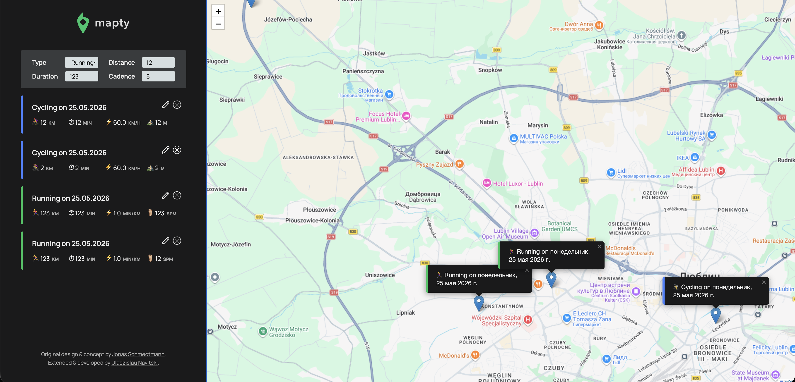

# 🗺️ Mapty: OOP Geolocation Workout Tracker

> A modern, interactive web application that allows users to log their running and cycling workouts on a map. Built completely with **Vanilla JavaScript**, demonstrating advanced Object-Oriented Programming (OOP) concepts, browser APIs, and third-party library integration.

## Key Features (Extended CRUD Version)

_Unlike the standard tutorial version, this project has been heavily extended to include full CRUD capabilities and robust state management._

- **Create:** Click anywhere on the map to log a new workout (Running or Cycling).
- **Read:** Workouts are rendered both in a sidebar list and as custom markers on the interactive map. Data persists across reloads via the **LocalStorage API**.
- **Update:** Inline editing of existing workouts. The UI dynamically toggles input fields based on the workout type, updating both the list and the Leaflet popup content dynamically.
- **Delete:** Remove individual workouts with a custom modal confirmation, safely unmounting Leaflet markers from the map instance using the library's official API to prevent memory leaks.
- **Map Navigation:** Clicking on a workout in the sidebar smoothly pans and zooms the map to the corresponding marker.

## Architecture & Technical Highlights

- **Advanced OOP:** Utilizes ES6 Classes (`class`, `extends`, `super()`) to create a robust hierarchy (`Workout` as a parent class, `Running` and `Cycling` as children).
- **Encapsulation:** Protects internal application state using modern ES2022 private class fields (`#workouts`, `#markers`, `#map`).
- **Event Delegation:** Implements global event listeners attached to parent containers to efficiently handle clicks on dynamically generated UI elements, drastically optimizing memory usage.
- **Context Binding:** Extensive use of the `.bind()` method to strictly preserve the execution context (`this`) within event handlers.
- **Modern JavaScript APIs:** Utilizes `crypto.randomUUID()` for robust identifier generation and `Intl.DateTimeFormat` for localization-aware date formatting.

## Tech Stack

- **Core:** HTML5, CSS3, Vanilla JavaScript (ES6+).
- **Mapping Provider:** Leaflet.js (Interactive Maps).
- **Deployment:** GitHub Pages.

---

_Engineered by [Uladzislau Navitski](https://github.com/VladsonX) | Based in Lublin, Poland_
